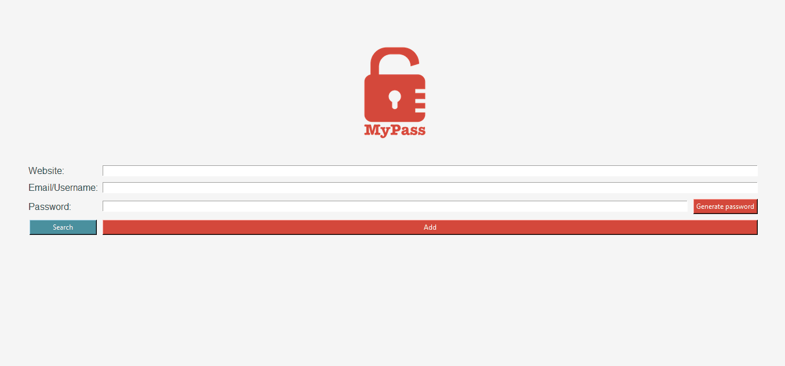

# Python Password Manager

A secure, local password manager built with Python's Tkinter library. This desktop application allows you to generate strong passwords, save credentials for multiple accounts, and view them securely, protected by a user-created master password.




## Features

- **Secure Master Password:** The application is secured by a user-created master password. On first use, you will be prompted to create one. The password is never stored directly; only a secure SHA-256 hash of it is saved.
- **Strong Password Generation:** Automatically generate strong, random passwords containing a mix of uppercase letters, lowercase letters, numbers, and symbols.
- **Multi-Account Storage:** Save multiple username/password pairs for a single website (e.g., personal and work accounts for Google). The application handles this seamlessly.
- **Click-to-Copy:** In the password list view, simply click on any entry to instantly and securely copy the password to your clipboard.
- **Clean & Intuitive UI:** A simple and user-friendly graphical interface built with Tkinter, featuring a custom color palette and responsive layout.
- **Local & Secure Storage:** All your credentials are saved locally in an encrypted `data.json` file, and your master password hash is stored in `config.json`. Your data is never sent to any cloud or server.

## Setup & How to Use

1.  **Prerequisites:**
    Make sure you have Python 3 installed on your system.

2.  **Clone the Repository:**
    ```bash
    git clone [https://github.com/cecilia-zica/password-manager.git](https://github.com/cecilia-zica/password-manager.git)
    cd password-manager
    ```

3.  **Install Dependencies:**
    This project uses the `Pillow` library for images and `pyperclip` for clipboard functionality. Install them using pip:
    ```bash
    pip install Pillow pyperclip
    ```

4.  **Run the Application:**
    Execute the `main.py` script from your terminal:
    ```bash
    python main.py
    ```

5.  **First Use:**
    - The first time you click the **"Search"** button, the application will detect that no master password is set and will prompt you to create one.
    - After setting your master password, you will use it every time you wish to view your saved credentials.
